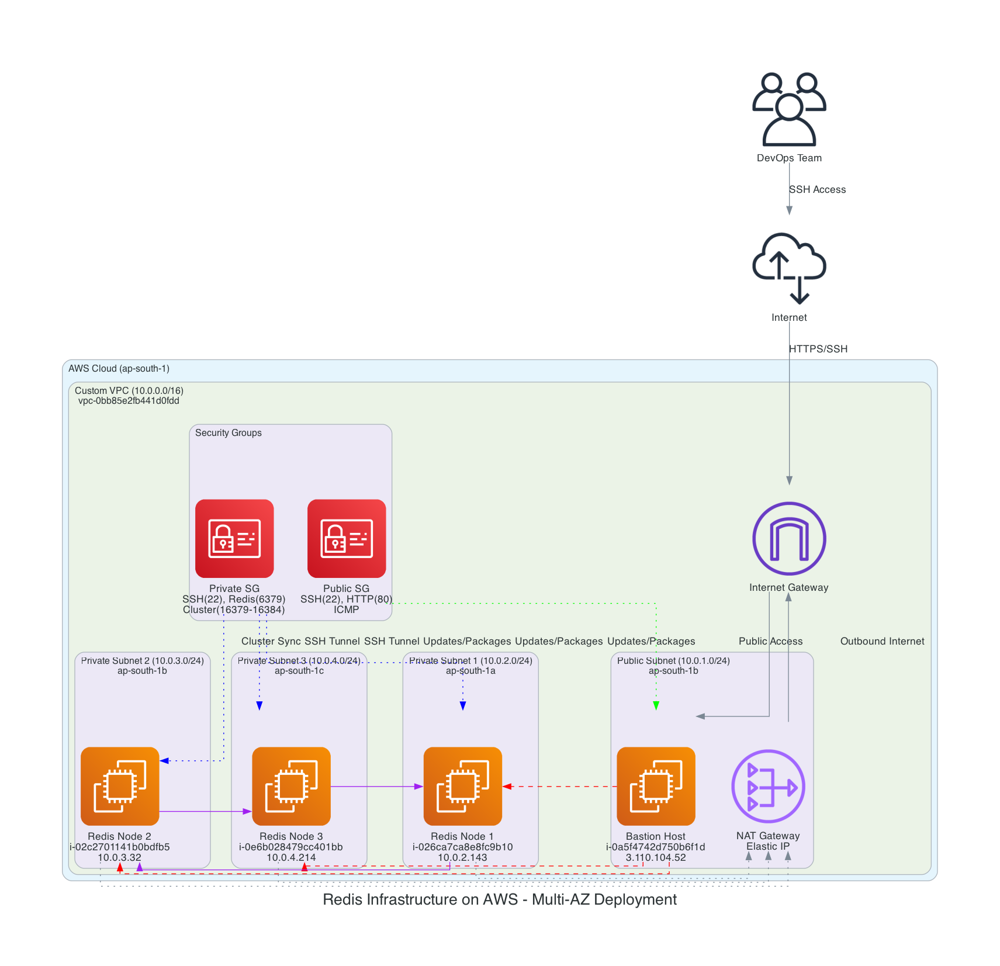
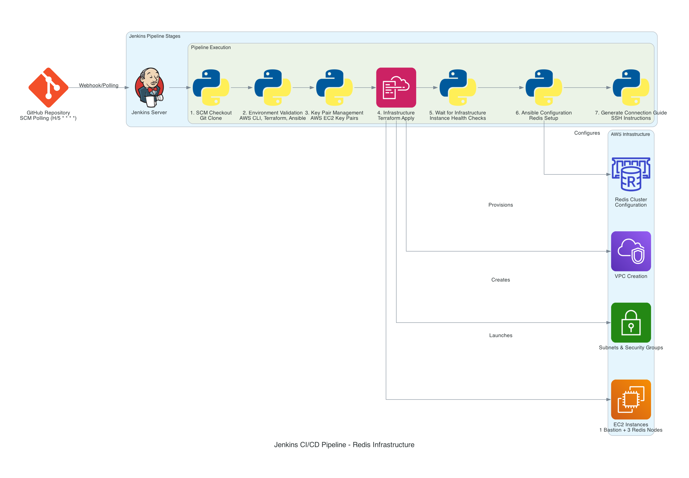
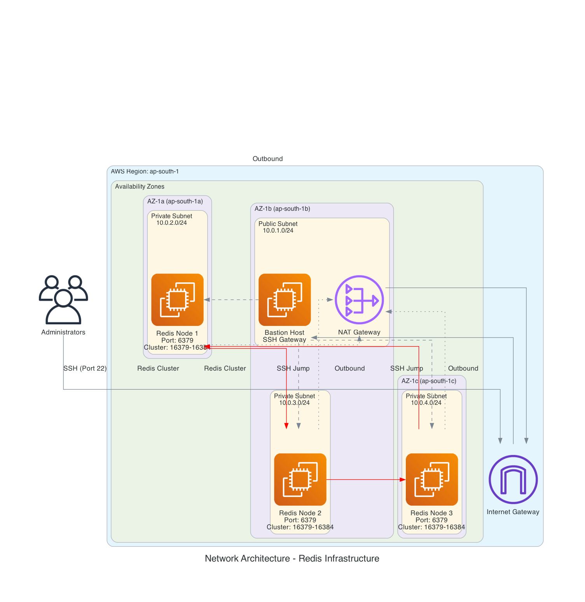

# Redis Infrastructure Template

## 🎯 Overview
This is a streamlined Redis infrastructure template for AWS deployment using Jenkins SCM polling pipeline.

## 🏗️ Architecture
- **Custom VPC** (10.0.0.0/16) with multi-AZ deployment
- **1 Bastion Host** (public subnet)
- **3 Redis Nodes** (private subnets across 3 AZs)
- **Security Groups** with proper Redis port configurations
- **NAT Gateway** for private subnet internet access

## 📊 Infrastructure Diagrams

Professional diagrams created with Python Diagrams library:

### 🏗️ Main Infrastructure


### 🔄 CI/CD Pipeline


### 🌐 Network Architecture


> **📋 See [DIAGRAMS_README.md](DIAGRAMS_README.md) for detailed diagram documentation**

## 🚀 Quick Start

### Prerequisites
- AWS CLI configured
- Jenkins with required plugins
- Terraform installed
- Ansible installed

### Jenkins Setup
1. Create new Pipeline job
2. Configure SCM: Point to your Git repository
3. Set up AWS credentials in Jenkins:
   - `AWS_ACCESS_KEY_ID`
   - `AWS_SECRET_ACCESS_KEY`

### Deployment
1. Push code to repository
2. Jenkins SCM polling will detect changes (every 5 minutes)
3. Pipeline will automatically deploy infrastructure
4. Download artifacts: SSH key, connection guide

## 📋 Pipeline Stages
1. **SCM Checkout** - Pull latest code
2. **Environment Validation** - Check AWS credentials and tools
3. **Key Pair Management** - Create/manage SSH keys
4. **Infrastructure** - Terraform provisioning
5. **Wait for Infrastructure** - Ensure instances are ready
6. **Ansible Configuration** - Configure Redis cluster
7. **Generate Connection Guide** - Create access instructions

## 🔧 Configuration Files
- `Jenkinsfile` - Jenkins pipeline definition
- `terraform/` - Infrastructure as Code
- `ansible.cfg` - Ansible configuration
- `playbook.yml` - Redis configuration playbook
- `create-clean-inventory.sh` - Dynamic inventory creation

## 📊 Infrastructure Details
- **Region**: ap-south-1 (Mumbai)
- **Instance Type**: t3.micro
- **Key Pair**: redis-infra-key
- **VPC CIDR**: 10.0.0.0/16

## 🏗️ Current Deployment Status

### **✅ Deployed Infrastructure**
```
VPC: vpc-0bb85e2fb441d0fdd (10.0.0.0/16)

Bastion Host: 3.110.104.52 (i-0a5f4742d750b6f1d)
Redis Node 1: 10.0.2.143 (i-026ca7ca8e8fc9b10) - ap-south-1a
Redis Node 2: 10.0.3.32 (i-02c2701141b0bdfb5)  - ap-south-1b
Redis Node 3: 10.0.4.214 (i-0e6b028479cc401bb) - ap-south-1c
```

## 🔗 Connection
After deployment, use the generated connection guide to access your infrastructure:
```bash
# Connect to bastion
ssh -i redis-infra-key.pem ubuntu@3.110.104.52

# Connect to Redis nodes via bastion
ssh -i redis-infra-key.pem -J ubuntu@3.110.104.52 ubuntu@10.0.2.143
ssh -i redis-infra-key.pem -J ubuntu@3.110.104.52 ubuntu@10.0.3.32
ssh -i redis-infra-key.pem -J ubuntu@3.110.104.52 ubuntu@10.0.4.214
```

## 🛠️ Management Tools

### **Cleanup Script**
```bash
./cleanup-duplicates.sh  # Remove duplicate instances
```

### **Generate Diagrams**
```bash
python3 -m venv diagram_env
source diagram_env/bin/activate
pip install diagrams
python create_redis_infrastructure_diagram.py
```

## 🧹 Cleanup
Set pipeline parameter `action=destroy` to clean up all resources.

## 📞 Support
Check Jenkins console output for detailed logs and troubleshooting information.

---

**📈 Status**: ✅ Deployed and Operational  
**🔄 Last Updated**: 2025-06-27  
**🌍 Region**: ap-south-1 (Mumbai)
